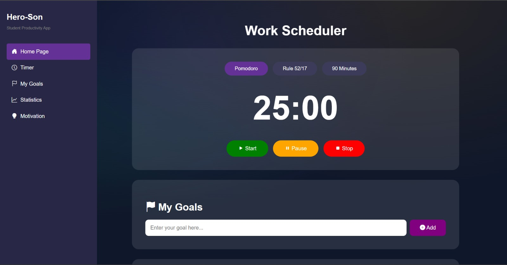

# Hero-Son Pomodoro UI

## Overview
Hero-Son Pomodoro is a **design-focused prototype of a productivity application** for students.  
This repository showcases the **user interface (UI) only** and is **not a working application**. The goal is to demonstrate **responsive layout, modern design, and intuitive UX**.

---

## Features
- **Responsive Design:** Fully adapts to mobile, tablet, and desktop screens.  
- **Multiple Work Modes:** Pomodoro, 52/17, and 90 Minutes mode buttons (UI only).  
- **Goal Management:** Input area to add personal goals (visual only).  
- **Motivation Corner:** Display of motivational quotes with “New Motivation” button (UI only).  
- **Sidebar Navigation:** Smooth sidebar layout with active menu highlight.  

---

## Technologies
- **HTML5** – Semantic and accessible structure.  
- **CSS3** – Modern styling with gradients, flexbox, and responsive media queries.  
- **Bootstrap Icons** – Clean vector icons for UI elements.

---

## Preview
> Below is a static preview of the UI. For live demonstration, see the GitHub Pages link below.

[Live Demo:]("https://erenkahramanoglu.github.io/hero-son-pomodoro/")
